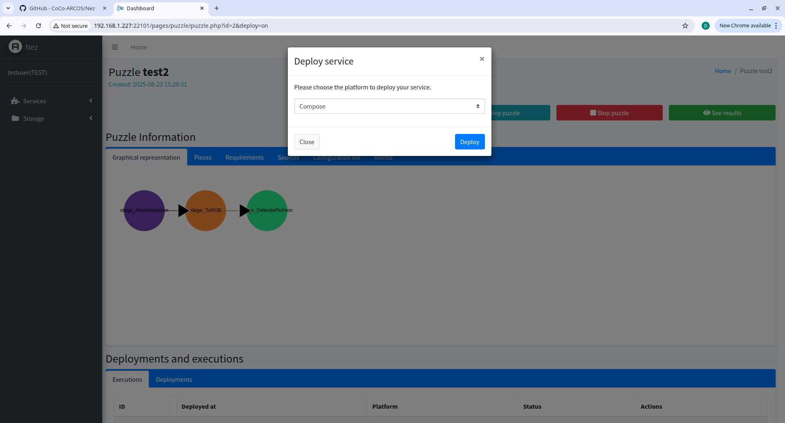
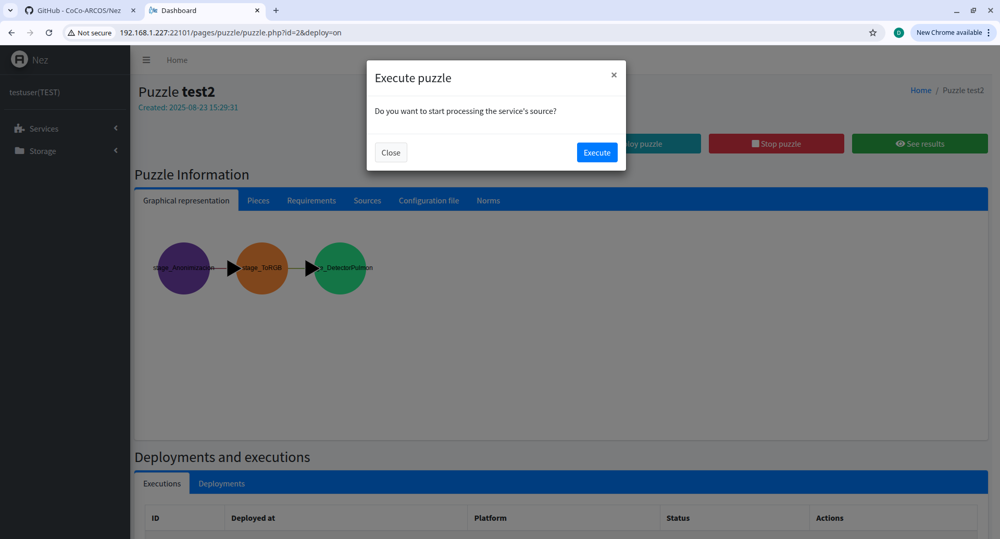
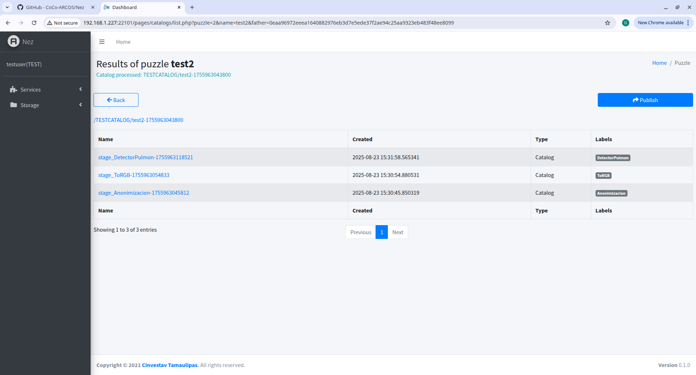

# Nez: A Design-Driven Skeleton Model for AI-Based and Analytic Systems on the Computing Continuum

This repository contains the code, datasets, and evaluation artifacts associated with the paper:

**"Nez: A design-driven skeleton model to build AI-based and analytic systems deployed on the computing continuum"**


## ⚠️ Repository Status

This repository is **under construction** and is being **constantly updated**.  
Expect frequent changes in features, scripts, and documentation.


---

## 📖 Overview

**Nez** is a design-driven skeleton model that enables the construction of AI-based and analytic systems that run seamlessly across the **computing continuum** (from edge to cloud to HPC).

### Key Features
- Automatic integration of AI applications with **security, fault-tolerance, and data management tools**.  
- A **self-similar construction model** based on generic and portable structures.  
- Simplified development of secure, efficient, and resilient AI pipelines.  

---

## 🏥 Case Study

Nez was evaluated in a real-world healthcare scenario at a Mexican hospital, where it was used to build systems for:
- **3D mesh tomography representation**  
- **Lung cancer diagnosis**  
- **ECG analysis reports**  

All systems were deployed for **continuous, secure delivery** of digital products to physicians.

---

## Services and Containers

The following services are defined in the ```docker-compose.yml``` file:

### Core Services 
- ```valuechain```: Graphical interface for building AI-based systems  
- ```value-chain-api```: API for system construction  
- ```deployer```: Deployment service with validation mechanisms  
- ```value-chain-api-db```: Database for system construction  
- ```container-manager```: Container manager  

### Data Management 
- ```apigateway```: API Gateway  
- ```auth```: User authentication  
- ```db_auth```: User database  
- ```frontend```: Catalog management interface  
- ```db_pub_sub```: Pub/Sub service  
- ```pub_sub```: Pub/Sub database  
- ```db_metadata```: Metadata service  
- ```metadata```: Metadata database  

### Storage & Load Balancing
- ```storage1, storage2, storage3, storage4, storage5```: Storage services  
- ```balancing```: Load balancing service  

### Data Preparation & Recovery 
- ```sincronizador```  data uploading client
- ```PreparationSchemes```  NRFs manager

---

## Software Prerequisites

Nez services run on container technology to simplify deployment. Install the following dependencies:

- [Docker v20.10.23](https://docs.docker.com/engine/install/ubuntu/)  
- [Docker Compose v2.15.1](https://docs.docker.com/compose/install/)  
- [Java 17 or higher](https://www.oracle.com/java/technologies/javase/jdk17-archive-downloads.html)  
- A Linux distribution is required to use the `install.sh` script  

# Installation and Configuration

To simplify the installation and deployment of **Nez** services, this project includes an `install.sh` script that automates the setup on a single machine. On a Linux terminal, run:

```bash
cd services
bash install.sh
```

You will be asked to confirm or manually enter the IP address of the machine where the services will be deployed.

---

## Key Steps in the Setup

### 1. Configure container volumes  
This ensures file sharing between services and with the host machine:

```bash
gateway="      URL: \"http://${my_ip}:20505\""
hostpath="      HOST_PATH: $PWD/deployer/app/"
volumehost="      - \"$PWD/deployer/app/:$PWD/deployer/app/\""

sed -i "225s#.*#$gateway#" ./docker-compose.yml
sed -i "64s#.*#$hostpath#" ./docker-compose.yml
sed -i "61s#.*#$volumehost#" ./docker-compose.yml
```

> This step sets static paths to ensure correct operation of Nez services and containers.

### 2. Run `configure.sh`  
This script creates test data and completes the system setup. Ensure the IP address matches the one used earlier:

```bash
cd services
bash configure.sh
```

### 3. Create a test organization and user  
Using Painal’s authentication service:

```bash
# Create organization
curl --header "Content-Type: application/json" --request POST --data '{ "acronym": "TEST", "fullname": "TESTORG", "fathers_token": "/" }' http://${my_ip}:20500/auth/v1/hierarchy/create 

# Create test user
curl --header "Content-Type: application/json" --request POST --data '{"username":"testuser","password":"TestUser123.", "email":"test@test.com", "tokenorg":"'$TOKEN_ORG'"}' http://${my_ip}:20500/auth/v1/users/create
```

### 4. Configure storage nodes  

```bash
for i in 06 07 08 09 10
do
    curl -X POST -F "capacity=40000000000" -F "memory=2000000000" -F "url=$my_ip:200$i/" http://$my_ip:20505/configNodesPost.php
    echo " "
done
```

### 5. Create a test catalog and upload data  

```bash
# Create catalog
curl --header "Content-Type: application/json" --request POST --data '{ "catalogname": "TESTCATALOG", "dispersemode": "false", "encryption":"true", "fathers_token":"/"}' http://${my_ip}:20500/pub_sub/v1/catalogs/create?access_token=$access_token

# Upload sample data
java -jar Upload.jar $tokenuser $apikey $tokencatalog SINGLE bob 2 $PWD/../datosprueba TESTORG true $access_token true false 4
```

### 6. Load and register skeletons in Nez  

```bash
# Load container images
docker load -i microservicios/cleaner.tar  
docker load -i microservicios/deteccion.tar  
docker load -i microservicios/dicomtorgb.tar  
docker load -i microservicios/tc.tar

# Register skeletons in Nez
curl --header "Content-Type: application/json" --request POST --data '{"name":"Anonimizacion", "command":"python3 /code/process_dir.py --input @I --outfolder \"@D\" --save dicom", "image":"ddomizzi/cleaner:header", "description":"Anonymization of DICOM images"}' "http://${my_ip}:20510/api/v1/buildingblocks?access_token=$tokenuser"

curl --header "Content-Type: application/json" --request POST --data '{"name":"ToRGB", "command":"python3 /code/dicom2rgb.py @I @D/@L", "image":"ddomizzi/dicomtorgb:v1", "description":"Convert DICOM images to RGB"}' "http://${my_ip}:20510/api/v1/buildingblocks?access_token=$tokenuser"

curl --header "Content-Type: application/json" --request POST --data '{"name":"DetectorPulmon", "command":"python3 /code/detectorPulmones.py @I @D/@L", "image":"ddomizzi/deteccion:pulmon", "description":"Lung anomaly detection in CT scans"}' "http://${my_ip}:20510/api/v1/buildingblocks?access_token=$tokenuser"
```

---

## Registered skeletons
- **Anonymization**: Removes personal data from DICOM metadata.  
- **ToRGB**: Converts DICOM images into PNG format.  
- **Lung Detector**: Identifies tumors in lung CT scans (PNG).  


## Example: Designing and Executing an AI-Based Service for Medical Image Management

1. To design a service, go to [http://localhost:22101/](http://localhost:22101/) (replace `localhost` with the IP address of the machine where the services were deployed) and log in with the following credentials:

   * **Email**: test@test.com  
   * **Password**: TestUser123.  

   

2. In the side menu, navigate to ```Systems > Create a system```. This screen will show the skeletons that were previously configured and registered. Click the ```Add``` button.

   

3. In **Step 2**, select the non-functional requirements you want to add to your data.  
4. In **Step 3**, choose the CDN data catalog to be processed.  
     
5. In **Step 4**, define the execution order of your skeletons.  
     

6. Click ```Save``` and provide a name for your solution. You will be redirected to the deployment screen, where you can select the deployment method:  
   - **Compose**: Deploy the solution on a single machine. 

      

   If you receive an error message during deployment, click the ```Deploy``` button again. You can verify that the containers were deployed by running the following command in a terminal:  

   ```bash
   docker ps
   ```

7. Once your services is deployed. Click on ```Execute``` to start the processing of data with your service.

    

8. This will start the processing of data. When completed, you can see the resultant files by clicking on ```See results``` button. This will redirect you to the Nez file manager. 

    

9. You can physically see your results by opening a file explorer and navigating to: ```services/deployer/app/results```. Here you can find the workspace of the services deployed.

    

## Contact

Dante Domizzi Sánchez Gallegos ([Dante D. Sánchez Gallegos](https://orcid.org/0000-0003-0944-9341)) [dantsanc@pa.uc3m.es]


## License
Shield: [![CC BY-SA 4.0][cc-by-sa-shield]][cc-by-sa]

This work is under a 
[Creative Commons Attribution-ShareAlike 4.0 International License][cc-by-sa].

[![CC BY-SA 4.0][cc-by-sa-image]][cc-by-sa]

[cc-by-sa]: http://creativecommons.org/licenses/by-sa/4.0/
[cc-by-sa-image]: https://licensebuttons.net/l/by-sa/4.0/88x31.png
[cc-by-sa-shield]: https://img.shields.io/badge/License-CC%20BY--SA%204.0-lightgrey.svg