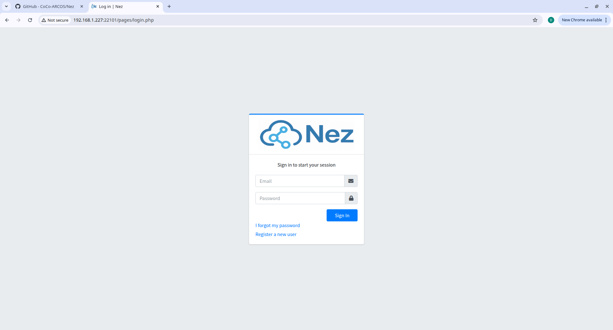
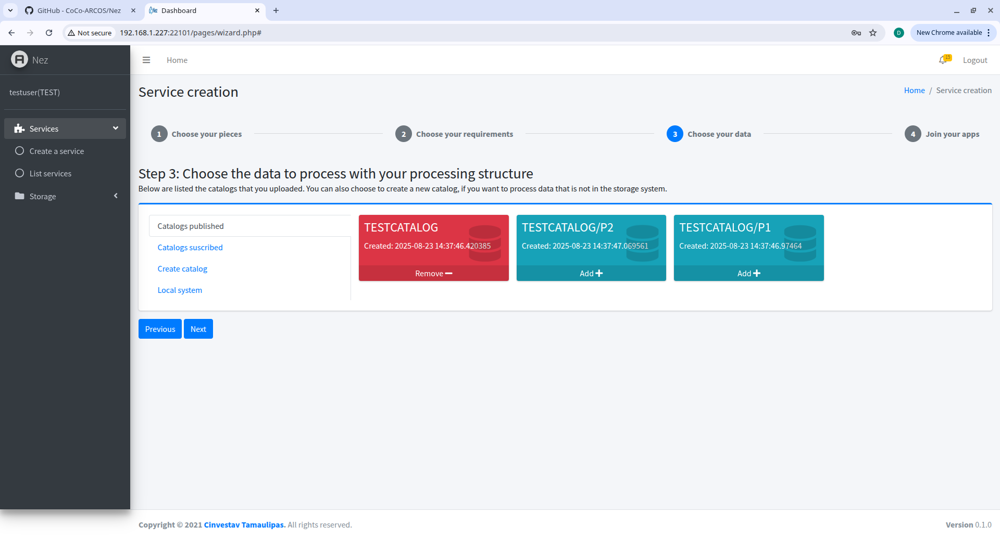
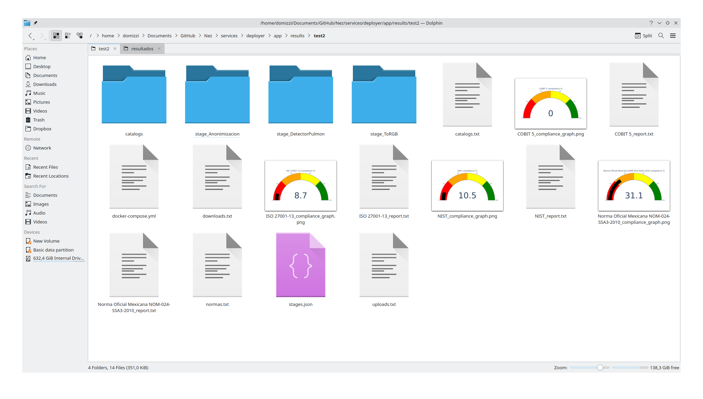
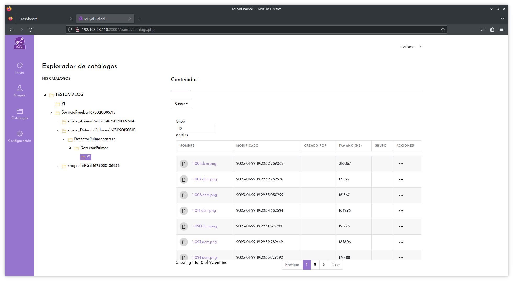

#  Muyal-Nez: diseño de servicios de e-salud


Muyal-Nez es un framework orientado al diseño que permite la construcción de sistemas de ciencia de datos para el procesamiento de datos no estructurados.

- Descubrimiento y reusabilidad de servicios de ciencia de datos disponibles en Muyal-Nez.
- Interconecta aplicaciones y crea servicios de e-salud intra e inter institucionales.
- Despliegue sencillo de servicios en diferentes infraestructuras (PC, servidores, la nube, etc.).
- Ciencia de datos como servicio, y construcción de sistemas paso a paso en la nube.
- Procesamiento eficiente de datos utilizando patrones de paralelismo.


## Proyecto Muyal-Ilal
La plataforma Muyal-Ilal fue construída como parte del proyecto _No. 41756_ de PRONACES titulado _"Plataforma tecnológica para la gestión, aseguramiento, intercambio y preservación de grandes volúmenes de datos en salud y construcción de un repositorio nacional de servicios de análisis de datos de salud"_. Además, con Muyal-Nez es posible utilizar Muyal-Chimalli y Muyal-Painal los cuales también forman parte de la plataforma Muyal-Ilal. 

_Muyal-Nez, Muyal-Chimalli y Muyal-Painal_ permiten cumplimentar los siguientes **productos comprometidos** en el CAR:

- Muyal-Nez:
    - Esquema de bloques de construcción de flujos de trabajo y servicios de e-Salud basado en mapas de microservicios y nanoservicios. (NMT 6)
    - Esquema de construcción de cripto-contenedores de datos y cripto-contenedores de aplicaciones. (NMT 5)
    - Esquema de despliegue de e-Servicios independientes de la infraestructura. (NMT 6)


**Productos** conseguidos con _Muyal-Nez_ **no comprometidos** en el CAR:

- Muyal-Nez:  
    - Servicio de descubrimiento, indexación y monitoreo de cripto contenedores de sistemas de e-salud. (NMT 5)


## Servicios y contenedores

Los siguientes servicios se encuentran declarados en el archivo ```docker-compose.yml```.

- Servicios de Muyal-Nez 
    + ```valuechain```: Interfaz gráfica para la construcción de sistemas de e-salud 
    + ```value-chain-api```: API para la construcción de sistemas de e-salud 
    + ```deployer```: Servicio para el despliegue de sistemas de e-salud que incluye un sistema de validación de normas 
    + ```value-chain-api-db```: Base de datos del servicio de construcción 
    + ```container-manager```: Manejador de contenedores 
- Los siguientes servicios de Muyal-Painal y Muyal-Chimalli son utilizados en Muyal-Nez para el manejo de datos:
    - Muyal-Painal
        + ```apigateway```: API Gateway 
        + ```auth```: Autenticación de usuarios 
        + ```db_auth```: Base de datos de usuarios 
        + ```frontend```: Interfaz gráfica del sistema de manejo de catálogos 
        + ```db_pub_sub```: Servicio de pub/sub 
        + ```pub_sub```: Base de datos del servicio de pub 
        + ```db_metadata```: Servicio de metadatos 
        + ```metadata```: Base de datos del servicio de metadatos 
        + ```storage1, storage2, storage3, storage4, storage5```: Servicios de almacenamiento 
        + ```balancing```: Servicio de balanceo de carga 
    - Servicios de Muyal-Zamna 
        + ```sincronizador``` y ```PreparationSchemes```: Clientes que incluyen los sistemas de preparación y recuperación de datos
 

## Pre-requisitos de software
Los servicios de Muyal-Nez funcionan utilizando la tecnología de contenedores virtuales para agilizar su despliegue.  Instale Docker siguiendo los enlaces que encontrará en los siguientes enlaces:

- [Docker v20.10.23](https://docs.docker.com/engine/install/ubuntu/)
- [Docker Compose v2.15.1](https://docs.docker.com/compose/install/)
- [Java 17 o superior](https://www.oracle.com/java/technologies/javase/jdk17-archive-downloads.html)
- Para utilizar el script install.sh se requiere una distribución Linux.


## Instalación y configuración

Para ver un tutorial de como utilizar los scripts descritos a continuación, puede consultar el video ```VideoDemostración.mp4```. Este video también se encuentra disponible en el siguiente enlace:

[Ver videodemostración](https://youtu.be/EhSGPeGAqPg)

Para agilizar la instalación y despliegue de los servicios de Nez, Painal y Chimalii, este proyecto contiene un script llamado ```install.sh``` que contiene todos los comandos para configurar y desplegar los servicios en un solo equipo para probar los servicios. En una terminal Linux ejecute los siguientes comandos:

```bash
  cd CodigoFuente
  bash install.sh
```

Deberá de confirmar su dirección IP o ingresar manualmente la IP del equipo donde se desplerán los servicios.

Los pasos más significativos del proceso de configuración e instalación incluídos en el script son los siguientes:


2. Configura los volumenes requeridos por los contenedores para compartir archivos entre ellos así como con el equipo anfitrión.

    ```bash
    gateway="      URL: \"http://${my_ip}:20505\""
    hostpath="      HOST_PATH: $PWD/deployer/app/"
    volumehost="      - \"$PWD/deployer/app/:$PWD/deployer/app/\""

    sed -i "225s#.*#$gateway#" ./docker-compose.yml
    sed -i "64s#.*#$hostpath#" ./docker-compose.yml
    sed -i "61s#.*#$volumehost#" ./docker-compose.yml
    ```

Note que en este paso se configuran rutas estáticas para asegurar el buen funcionamiento de los servicios y contenedores de Nez.

Posteriormente ejecute el archivo configure.sh para crear datos de prueba en el sistema y terminar la configuración del mismo. Por favor, asegurese que la dirección IP es la misma utilizada en el script anterior.

```bash
  cd CodigoFuente
  bash configure.sh
```


1. Se crea una organización y usuario de prueba utilizando el servicio de autenticación de Painal.

    ```bash
    #crea una organización
    curl --header "Content-Type: application/json" \
    --request POST \
    --data '{    "acronym": "TEST",    "fullname": "TESTORG",    "fathers_token": "/" }' \
    http://${my_ip}:20500/auth/v1/hierarchy/create 

    
    #Crea un usuario de prueba
    curl --header "Content-Type: application/json" \
    --request POST \
    --data '{"username":"testuser","password":"TestUser123.", "email":"test@test.com", "tokenorg":"'$TOKEN_ORG'"}' \
    http://${my_ip}:20500/auth/v1/users/create
    ```

1. Se configuran los nodos de almacenamiento de Painal.

    ```bash
    for i in 06 07 08 09 10
    do
        curl -X POST -F "capacity=40000000000" -F "memory=2000000000" -F "url=$my_ip:200$i/" http://$my_ip:20505/configNodesPost.php
        echo " "
    done
    ```

1. Se crea un catálogo de pruebas utilizando el servicio de publicación/suscripción de Painal y utilizando los demonios de Chimalli se cargan datos de la carpeta ```datosprueba```  en el sistema de almacenamiento de Painal.

    ```bash
    #Crea un catálogo de pruebas
    curl --header "Content-Type: application/json" \
    --request POST \
    --data '{ "catalogname": "TESTCATALOG", "dispersemode": "false", "encryption":"true", "fathers_token":"/"}' \
    http://${my_ip}:20500/pub_sub/v1/catalogs/create?access_token=$access_token
    

    #Se cargan los datos de la carpeta datosprueba en el sistema de almacenamiento
    java -jar Upload.jar $tokenuser $apikey $tokencatalog SINGLE bob 2 $PWD/../datosprueba TESTORG true $access_token true false 4
    ```


1. Se cargan las imágenes de contenedor de tres microservicios para el manejo de imágenes médicas, y se registran en Nez.

    ```bash
    #Se cargan las imágenes de contenedor
    docker load -i microservicios/cleaner.tar  
    docker load -i microservicios/deteccion.tar  
    docker load -i microservicios/dicomtorgb.tar  
    docker load -i microservicios/tc.tar

    #Se registran los microservicios en Nez
    curl --header "Content-Type: application/json" \
    --request POST \
    --data '{"name":"Anonimizacion", "command":"python3 /code/process_dir.py --input @I --outfolder \"@D\" --save dicom", "image":"ddomizzi/cleaner:header", "description":"Anonimizacion de imagenes DICOM" }' \
    "http://${my_ip}:20510/api/v1/buildingblocks?access_token=$tokenuser"

    curl --header "Content-Type: application/json" \
    --request POST \
    --data '{"name":"ToRGB", "command":"python3 /code/dicom2rgb.py @I @D/@L", "image":"ddomizzi/dicomtorgb:v1", "description":"Convierte imagenes DICOM en RGB" }' \
    "http://${my_ip}:20510/api/v1/buildingblocks?access_token=$tokenuser"

    curl --header "Content-Type: application/json" \
    --request POST \
    --data '{"name":"DetectorPulmon", "command":"python3 /code/detectorPulmones.py @I @D/@L", "image":"ddomizzi/deteccion:pulmon", "description":"Deteccion de anomalias en pulmon" }' \
    "http://${my_ip}:20510/api/v1/buildingblocks?access_token=$tokenuser"

    ```

    Con este comando se agregan los siguientes microservicios:

    - **Anonimización**: servicio que anonimiza imágenes DICOM, removiendo los datos personales que aparezcan en los metadatos de estas.
    - **ToRGB**: convierte las imágenes DICOM en formato PNG.
    - **Detector pulmón**: identifica tumores en tomografías de pulmón en formato PNG.

## Ejemplo del diseño y ejecución de un servicio de e-salud para el manejo de imágenes médicas


1. Para diseñar un servicio de eSalud, dirigase a  [http://localhost:22101/](http://localhost:22101/) (sustituya localhost por la dirección IP del equipo donde ser desplegaron los servicios) e inicie sesión con los siguientes datos:

    * Correo electronico: test@test.com
    * Contraseña: TestUser123.

    


2. En el menú lateral navegue a ```Puzzles>Create a puzzle```. En esta pantalla apareceran los microservicios previamente configurados y registrados. Presione el botón ```Add```.

    

3. En el paso 2, seleccione los requerimientos no funcionales que desea agregar a sus datos con Chimalli.
4. En el paso 3, seleccione el catálogo de datos de Painal a procesar.
    
5. En el paso 4, indique el orden de ejecuión de sus microservicios.
    
6. De clic en el botón ```Save``` e indique el nombre de la solución a desplegar. Será redirigido a la pantalla desde donde podrá desplegar su solución. Seleccione el método de despliegue:
    - __Compose__: Despliegue de la solución en un solo equipo.j

    En caso de recibir un mensaje de error durante el despliegue de su solución, vuelva a dar clic sobre el botón ```Deploy```. Puede verificar que se han desplegado los contenedores de su solución  escribiendo en una terminal el comando ```docker ps```.

    ---

7. Cuando se haya completado el despliegue de la solución, podrá realizar la ejecución de este y el procesamiento de datos presionando el botón ```Execute```. Esto inicirá el procesamiento de los datos en segundo plano. Para ver los resultados del procesamiento, en su sistema de archivo dirigasé a ```deployer/app/results```. Aquí podrá ver los directorios de trabajo de cada solución creada. Cada directorio incluye los archivos de configuración de la solución, un reporte generado con Chimalli que incluye el porcentaje de diferentes normas nacionales e internacionales y los resultados de cada etapa de procesamiento.
    
7. Los resultados del procesamiento serán cargados autómaticamente en Painal utilizando el cliente de Chimalli. Para visualizar los datos cargados en Painal dirigasé a [http://localhost:20004/painal](http://localhost:20004/painal) e inicie sesión con su usuario y contraseña. En el menú lateral dirigase a ```Catálogos```.
    


## Autores

__Muyal-Nez:__

* Autor: Dante Domizzi Sánchez Gallegos ([Dante D. Sánchez Gallegos](https://orcid.org/0000-0003-0944-9341))
    * Email: dante.sanchez@cinvestav.mx

* Autor: José Luis González Compeán ([J.L. González-Compeán](https://orcid.org/0000-0002-2160-4407))
    * Email: joseluis.gonzalez@cinvestav.mx

_Este trabajo forma parte del proyecto 41756 "Plataforma tecnológica para la gestión, aseguramiento, intercambio y preservacion de grandes volúmenes de datos en salud y construccion de un repositorio nacional de servicios de análisis de datos de salud" por FORDECYT-PRONACES._

Si desea usar el software disponible, favor de hacer refencia tanto a este proyecto como a los siguientes artículos:

__Muyal-Nez:__
- Sanchez-Gallegos, D. D., Gonzalez-Compean, J. L., Carretero, J., Marin, H., Tchernykh, A., & Montella, R. (2022). PuzzleMesh: A puzzle model to build mesh of agnostic services for edge-fog-cloud. IEEE Transactions on Services Computing.

```bib
@article{sanchez2022puzzlemesh,
    title={PuzzleMesh: A puzzle model to build mesh of agnostic services for edge-fog-cloud},
    author={Sanchez-Gallegos, Dante Domizzi and Gonzalez-Compean, JL and Carretero, Jesus and Marin, Heidy and Tchernykh, Andrei and Montella, Raffaele},
    journal={IEEE Transactions on Services Computing},
    year={2022},
    publisher={IEEE}
}
```


## Licencia
Shield: [![CC BY-SA 4.0][cc-by-sa-shield]][cc-by-sa]

Este trabajo se encuentra bajo una licencia 
[Creative Commons Attribution-ShareAlike 4.0 International License][cc-by-sa].

[![CC BY-SA 4.0][cc-by-sa-image]][cc-by-sa]

[cc-by-sa]: http://creativecommons.org/licenses/by-sa/4.0/
[cc-by-sa-image]: https://licensebuttons.net/l/by-sa/4.0/88x31.png
[cc-by-sa-shield]: https://img.shields.io/badge/License-CC%20BY--SA%204.0-lightgrey.svg

Copyright 2023 Dante Domizzi Sánchez Gallegos, Diana Elizabeth Carrizales Espinoza,
   José Luis Gonzalez Compeán y Consejo Nacional de Ciencia y Tecnología (CONACYT)

Licensed under the Apache License, Version 2.0 (the "License");
you may not use this file except in compliance with the License.
You may obtain a copy of the License at

    http://www.apache.org/licenses/LICENSE-2.0

Unless required by applicable law or agreed to in writing, software
distributed under the License is distributed on an "AS IS" BASIS,
WITHOUT WARRANTIES OR CONDITIONS OF ANY KIND, either express or implied.
See the License for the specific language governing permissions and
limitations under the License.
