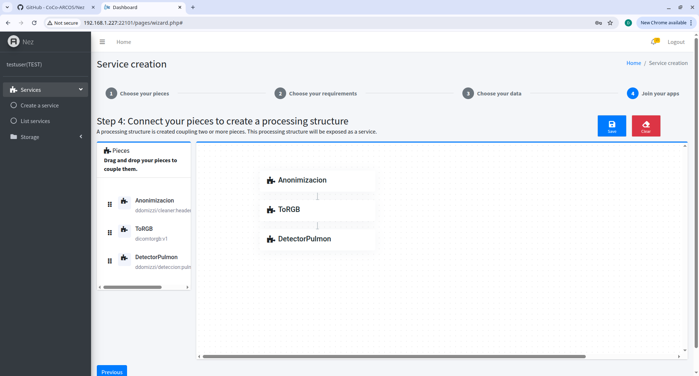

# Deployment example

To simplify the installation and deployment of **Nez** services, this project includes an `install.sh` script that automates the setup on a single machine. On a Linux terminal, run:

```bash
cd services
bash install.sh
```

You will be asked to confirm or manually enter the IP address of the machine where the services will be deployed.

---

## Key Steps in the Setup

### 1. Configure container volumes  
This ensures file sharing between services and with the host machine:

```bash
gateway="      URL: \"http://${my_ip}:20505\""
hostpath="      HOST_PATH: $PWD/deployer/app/"
volumehost="      - \"$PWD/deployer/app/:$PWD/deployer/app/\""

sed -i "225s#.*#$gateway#" ./docker-compose.yml
sed -i "64s#.*#$hostpath#" ./docker-compose.yml
sed -i "61s#.*#$volumehost#" ./docker-compose.yml
```

> This step sets static paths to ensure correct operation of Nez services and containers.

### 2. Run `configure.sh`  
This script creates test data and completes the system setup. Ensure the IP address matches the one used earlier:

```bash
cd CodigoFuente
bash configure.sh
```

### 3. Create a test organization and user  
Using Painal’s authentication service:

```bash
# Create organization
curl --header "Content-Type: application/json" --request POST --data '{ "acronym": "TEST", "fullname": "TESTORG", "fathers_token": "/" }' http://${my_ip}:20500/auth/v1/hierarchy/create 

# Create test user
curl --header "Content-Type: application/json" --request POST --data '{"username":"testuser","password":"TestUser123.", "email":"test@test.com", "tokenorg":"'$TOKEN_ORG'"}' http://${my_ip}:20500/auth/v1/users/create
```

### 4. Configure storage nodes  

```bash
for i in 06 07 08 09 10
do
    curl -X POST -F "capacity=40000000000" -F "memory=2000000000" -F "url=$my_ip:200$i/" http://$my_ip:20505/configNodesPost.php
    echo " "
done
```

### 5. Create a test catalog and upload data  

```bash
# Create catalog
curl --header "Content-Type: application/json" --request POST --data '{ "catalogname": "TESTCATALOG", "dispersemode": "false", "encryption":"true", "fathers_token":"/"}' http://${my_ip}:20500/pub_sub/v1/catalogs/create?access_token=$access_token

# Upload sample data
java -jar Upload.jar $tokenuser $apikey $tokencatalog SINGLE bob 2 $PWD/../datosprueba TESTORG true $access_token true false 4
```

### 6. Load and register skeletons in Nez  

```bash
# Load container images
docker load -i microservicios/cleaner.tar  
docker load -i microservicios/deteccion.tar  
docker load -i microservicios/dicomtorgb.tar  
docker load -i microservicios/tc.tar

# Register skeletons in Nez
curl --header "Content-Type: application/json" --request POST --data '{"name":"Anonimizacion", "command":"python3 /code/process_dir.py --input @I --outfolder \"@D\" --save dicom", "image":"ddomizzi/cleaner:header", "description":"Anonymization of DICOM images"}' "http://${my_ip}:20510/api/v1/buildingblocks?access_token=$tokenuser"

curl --header "Content-Type: application/json" --request POST --data '{"name":"ToRGB", "command":"python3 /code/dicom2rgb.py @I @D/@L", "image":"ddomizzi/dicomtorgb:v1", "description":"Convert DICOM images to RGB"}' "http://${my_ip}:20510/api/v1/buildingblocks?access_token=$tokenuser"

curl --header "Content-Type: application/json" --request POST --data '{"name":"DetectorPulmon", "command":"python3 /code/detectorPulmones.py @I @D/@L", "image":"ddomizzi/deteccion:pulmon", "description":"Lung anomaly detection in CT scans"}' "http://${my_ip}:20510/api/v1/buildingblocks?access_token=$tokenuser"
```

---

## Registered skeletons
- **Anonymization**: Removes personal data from DICOM metadata.  
- **ToRGB**: Converts DICOM images into PNG format.  
- **Lung Detector**: Identifies tumors in lung CT scans (PNG).  


## Example: Designing and Executing an AI-Based Service for Medical Image Management

1. To design a service, go to [http://localhost:22101/](http://localhost:22101/) (replace `localhost` with the IP address of the machine where the services were deployed) and log in with the following credentials:

   * **Email**: test@test.com  
   * **Password**: TestUser123.  

   

2. In the side menu, navigate to ```Systems > Create a system```. This screen will show the skeletons that were previously configured and registered. Click the ```Add``` button.

   

3. In **Step 2**, select the non-functional requirements you want to add to your data using Chimalli.  
4. In **Step 3**, choose the Painal data catalog to be processed.  
     
5. In **Step 4**, define the execution order of your skeletons.  
     

6. Click ```Save``` and provide a name for your solution. You will be redirected to the deployment screen, where you can select the deployment method:  
   - **Compose**: Deploy the solution on a single machine.  

   If you receive an error message during deployment, click the ```Deploy``` button again. You can verify that the containers were deployed by running the following command in a terminal:  

   ```bash
   docker ps